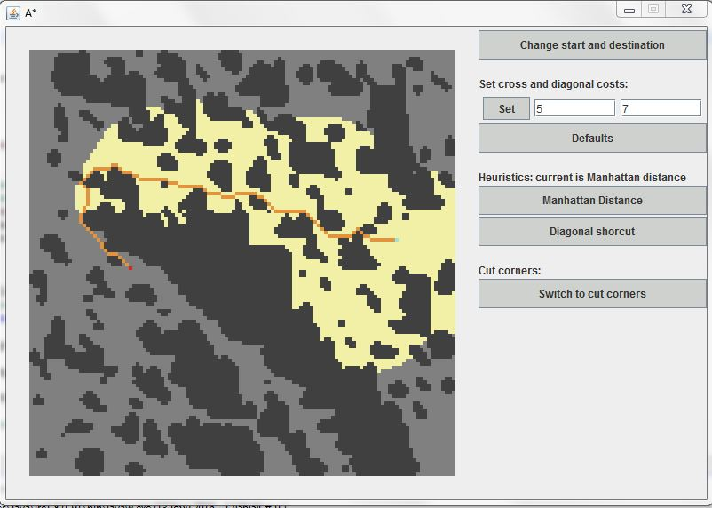

## **Initial implementation of A\* algorithm**

The openlist is a hash-map enhanced binary heap for performance reasons. A GUI is provided, with a random map created every time for testing purposes.

## **GUI**

#### **Map**
Every time the gui opens a random map is created. There are two colors in it, light and dark grey, which represent if the terrain is accesible or not respectively. When a tile is pressed its color alternates between these two colors.

#### **Path**
The orange color shows the path selected from start to finish. The yellow segments are tiles which the algorithm examined but didn't include in the path.

#### **Path redraw**
When a tile is pressed it is checked if this action affects the calculations for the chosen path. If yes the path is recalculated and redrawn.

#### **Buttons**
The function of each button on the right is self explanatory except from the last. That button prevents the algorithm from 'jumping' over the edges of obstacles and results in more natural paths.

